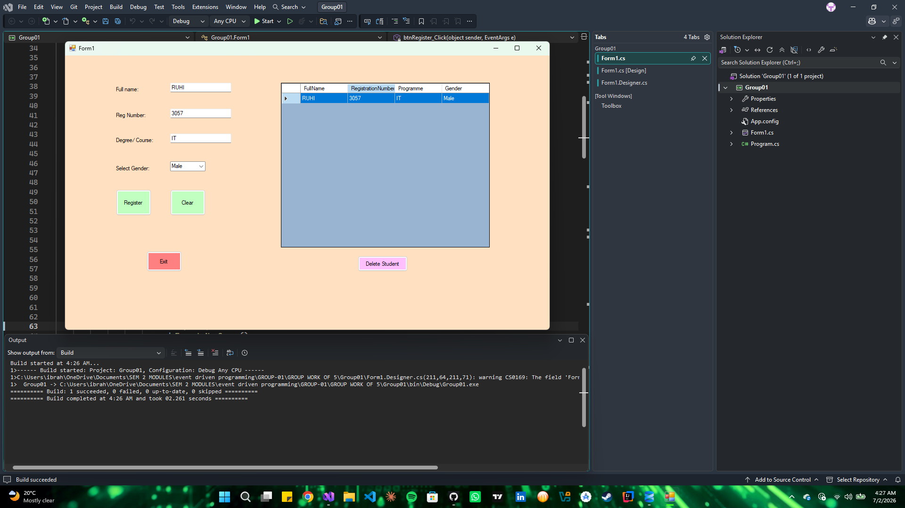

# Student Management System

A desktop-based CRUD application built with C# Windows Forms and SQL Server. This system allows administrators to manage student records dynamically with a local database backend.

##  Features
* **Full CRUD Operations:** Register, view, and delete student data seamlessly.
* **Database Persistence:** Integrated with Microsoft SQL Server using ADO.NET (`SqlClient`).
* **UI Controls:** Features an interactive, read-only `DataGridView` component with full-row selection to populate editing fields automatically.
* **Data Security:** Implements parameterized SQL queries to safeguard against SQL Injection attacks.

##  Tech Stack
* **Frontend:** C# Windows Forms (.NET Framework)
* **Backend:** Microsoft SQL Server (SSMS)
* **Data Provider:** System.Data.SqlClient

##  Database Schema
```sql
CREATE TABLE Students (
    FullName VARCHAR(150) NOT NULL,
    RegistrationNumber VARCHAR(50) PRIMARY KEY,
    Programme VARCHAR(100) NOT NULL,
    Gender VARCHAR(10) NOT NULL
);

